<div align="center">


# � SmartAgenda - Sistema de Gestão para Barbearias

**Solução Completa e Inteligente para Gestão de Barbearias**

[](https://reactnative.dev/)
[](https://expo.dev/)
[](https://www.typescriptlang.org/)
[](https://supabase.com/)
[](https://opensource.org/licenses/MIT)

[Funcionalidades](#-funcionalidades) • [Screenshots](#-screenshots-da-aplicação) • [Instalação](#-instalação) • [Documentação](#-configuração-do-supabase) • [Deploy](#-deploy)

</div>

---

## 📋 Índice
- [Visão Geral](#visão-geral)
- [Arquitetura](#arquitetura)
- [Funcionalidades](#funcionalidades)
- [Requisitos](#requisitos)
- [Instalação](#instalação)
- [Configuração do Supabase](#configuração-do-supabase)
- [Estrutura do Projeto](#estrutura-do-projeto)
- [Papéis e Permissões](#papéis-e-permissões)
- [Fluxos Principais](#fluxos-principais)
- [Deploy](#deploy)

---

## 🎯 Visão Geral

O **SmartAgenda** é um sistema completo e moderno de gestão para barbearias, desenvolvido com as melhores tecnologias do mercado. Oferece uma experiência mobile nativa com design inspirado nos melhores aplicativos do mercado (iOS, Instagram, Airbnb), proporcionando uma interface intuitiva e elegante.

### 🌟 Diferenciais

- **🤖 Assistente IA Integrado**: Chatbot inteligente para auxiliar nas operações diárias
- **📊 Dashboard Inteligente**: Visualização clara de métricas e KPIs em tempo real
- **🔒 Segurança Avançada**: Row Level Security (RLS) e autenticação JWT
- **📱 Multi-plataforma**: iOS, Android e Web
- **☁️ 100% Cloud**: Dados sincronizados em tempo real com Supabase
- **🎨 Design Moderno**: Interface intuitiva e responsiva

### ✅ Principais Recursos

- ✅ **Autenticação e Autorização** com múltiplos níveis de acesso (Admin, Barbeiro, Atendente)
- ✅ **Agenda Digital** com visualização diária e gestão de status de compromissos
- ✅ **Sistema de Vendas (PDV)** completo para serviços e produtos
- ✅ **Controle de Estoque** automático com alertas de produtos em falta
- ✅ **Dashboard Analytics** com métricas em tempo real (faturamento, ticket médio, atendimentos)
- ✅ **Multi-tenant** com isolamento total de dados por barbearia
- ✅ **Gestão de Clientes** com histórico completo de atendimentos
- ✅ **Relatórios Financeiros** detalhados e exportáveis
- ✅ **Design Responsivo** adaptado para tablets e smartphones

**Tecnologias:**
- **Frontend**: React Native 0.79 + Expo 53 + TypeScript
- **Backend**: Supabase (PostgreSQL + Auth + Storage + Real-time)
- **State Management**: React Query (TanStack Query)
- **Utilitários**: date-fns, lucide-react-native
- **Segurança**: Row Level Security (RLS) + JWT
- **IA**: Integração com Groq AI para assistente virtual

---

## 🏗️ Arquitetura

### Frontend (React Native)
```
app/
├── (tabs)/              # Navegação principal
│   ├── index.tsx        # Dashboard
│   ├── agenda.tsx       # Agenda de compromissos
│   ├── vendas.tsx       # Histórico de vendas
│   └── cadastros.tsx    # Menu de cadastros
├── login.tsx            # Tela de login
└── _layout.tsx          # Root layout com auth guard

contexts/
└── AuthContext.tsx      # Contexto de autenticação

lib/
└── supabase.ts          # Cliente Supabase configurado

types/
└── database.ts          # TypeScript types do banco
```

### Backend (Supabase)
- **Autenticação**: Supabase Auth com JWT
- **Banco de Dados**: PostgreSQL com Row Level Security (RLS)
- **Storage**: Armazenamento de recibos, relatórios, logos
- **Real-time**: Suporte a subscriptions (futuro)

### Banco de Dados
Veja `database/schema.sql` para o schema completo com:
- 12 tabelas principais
- Políticas RLS em todas as tabelas
- Triggers automáticos (estoque, totais)
- Views para relatórios
- Funções de negócio (conflito de agendamentos, métricas)

---

## ✨ Funcionalidades

### 1. 🔐 Autenticação e Segurança
- **Login Seguro** por email/senha com validação robusta
- **Recuperação de Senha** via email
- **Sessão Persistente** com refresh token automático
- **Row Level Security (RLS)** - isolamento total de dados por tenant
- **3 Níveis de Acesso**:
  - 👑 **Admin**: Acesso total ao sistema
  - ✂️ **Barbeiro**: Agenda própria e vendas
  - 📋 **Atendente**: Gestão de agenda e vendas

### 2. 📊 Dashboard Inteligente
- **Métricas da Semana em Tempo Real**:
  - 💰 Faturamento total
  - ✂️ Atendimentos concluídos/totais
  - 💵 Ticket médio
  - 👥 Total de clientes ativos
- **Gráficos Visuais** para análise rápida
- **Cards Coloridos** com informações destacadas
- **Pull-to-Refresh** para atualização instantânea
- **🤖 Assistente IA** integrado para insights e sugestões

### 3. 📅 Agenda Digital Avançada
- **Visualização Diária** com navegação intuitiva
- **Lista de Compromissos** organizada por horário
- **Status Coloridos** para fácil identificação:
  - 🔵 Agendado
  - 🟢 Confirmado
  - 🟡 Em andamento
  - ✅ Concluído
  - 🔴 Cancelado
  - ⚫ Faltou (No-show)
- **Filtros por Barbeiro** (em desenvolvimento)
- **Indicador de "Hoje"** destacado
- **FAB (+)** para novo agendamento rápido
- **Validação de Conflitos** automática

### 4. 💰 Sistema de Vendas (PDV)
- **Histórico Completo** de vendas mensais
- **Cards de Resumo**:
  - Total do mês
  - Número de vendas
  - Ticket médio
- **Detalhes de Cada Venda**:
  - Itens vendidos (serviços + produtos)
  - Múltiplos métodos de pagamento
  - Descontos aplicados
  - Cliente associado
- **PDV Intuitivo** para nova venda
- **Geração de Recibos** (futuro)

### 5. 👥 Gestão de Clientes
- **Cadastro Completo** com dados pessoais e contato
- **Histórico de Atendimentos** por cliente
- **Preferências e Observações**
- **Busca e Filtros** avançados
- **Perfil Detalhado** com estatísticas

### 6. 💈 Gerenciamento de Serviços e Produtos
- **Catálogo de Serviços** personalizável
- **Controle de Produtos** com estoque
- **Precificação Flexível**
- **Categorização** para melhor organização
- **Fotos de Produtos** (integração com Storage)

### 7. 📊 Relatórios e Análises
- **Relatórios Financeiros**:
  - Faturamento diário, semanal, mensal
  - Performance por barbeiro
  - Serviços mais vendidos
  - Análise de produtos
- **Exportação** em CSV/PDF (futuro)
- **Gráficos Interativos** (linha, barra, pizza)

### 8. 🏢 Multi-tenant (Multi-loja)
- Cada barbearia é um **tenant independente**
- **Isolamento Total** de dados via RLS
- **Configurações Personalizadas** por tenant:
  - Horários de funcionamento
  - Duração padrão de serviços
  - Logo e identidade visual
- **Escalabilidade** para múltiplas unidades

---

## 📦 Requisitos

### Pré-requisitos

- **Node.js** 18+ ([Download](https://nodejs.org/))
- **Bun** - Gerenciador de pacotes rápido ([Instalação](https://bun.sh/))
- **Expo Go** - App para testar em dispositivo físico:
  - [iOS App Store](https://apps.apple.com/app/expo-go/id982107779)
  - [Android Play Store](https://play.google.com/store/apps/details?id=host.exp.exponent)
- **Conta Supabase** - Banco de dados e autenticação (gratuita: [supabase.com](https://supabase.com/))
- **Conta Groq** (opcional) - Para assistente IA ([console.groq.com](https://console.groq.com/))

### Ferramentas Recomendadas

- **VS Code** com extensões:
  - React Native Tools
  - TypeScript
  - ESLint
  - Prettier
- **Expo CLI** global: `npm install -g expo-cli eas-cli`

---

## � Screenshots da Aplicação

### 🏠 Telas Principais

<div align="center">
  <table>
    <tr>
      <td align="center">
        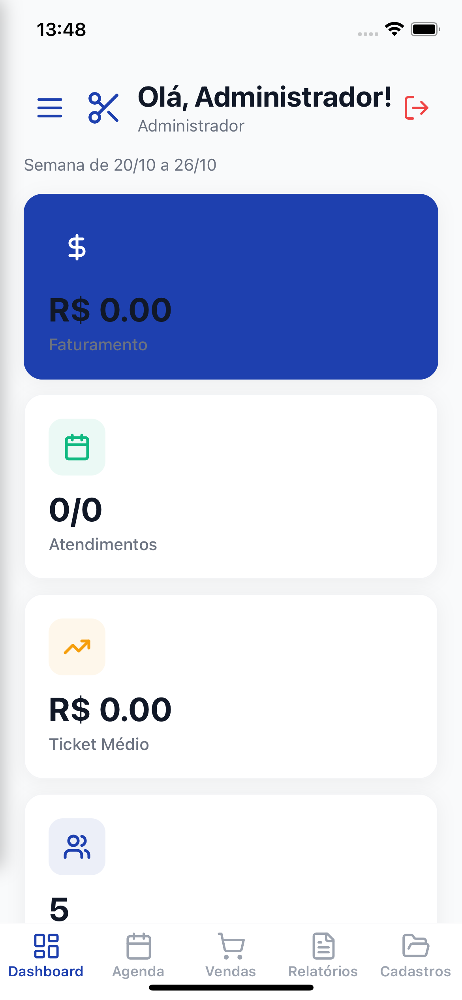
        <br />
        <strong>Dashboard Principal</strong>
      </td>
      <td align="center">
        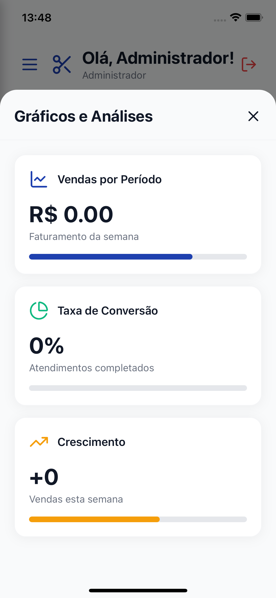
        <br />
        <strong>Gráficos e Análises</strong>
      </td>
      <td align="center">
        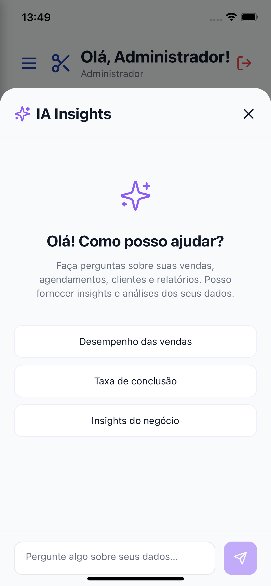
        <br />
        <strong>Assistente IA</strong>
      </td>
    </tr>
  </table>
</div>

### 🔐 Autenticação

<div align="center">
  <table>
    <tr>
      <td align="center">
        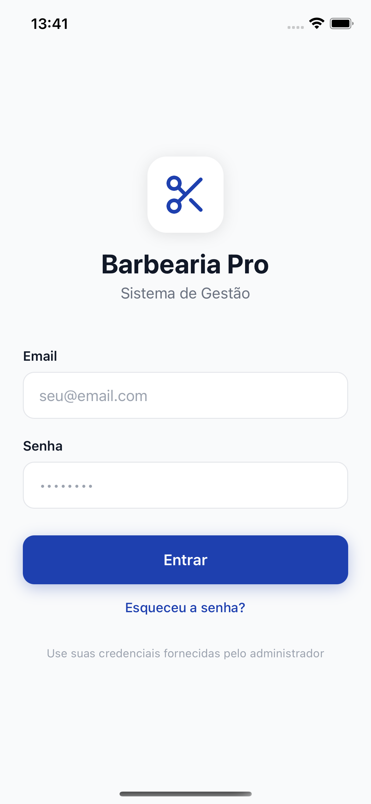
        <br />
        <strong>Login Seguro</strong>
      </td>
      <td align="center">
        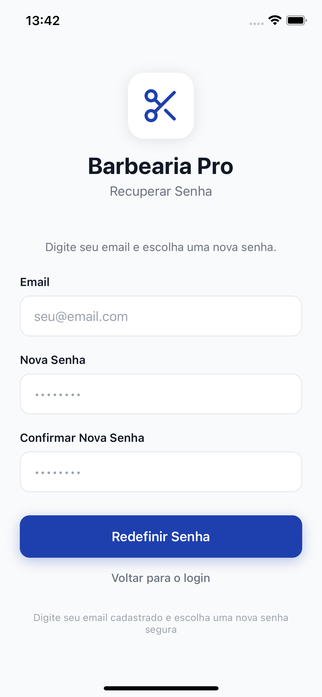
        <br />
        <strong>Recuperação de Senha</strong>
      </td>
      <td align="center">
        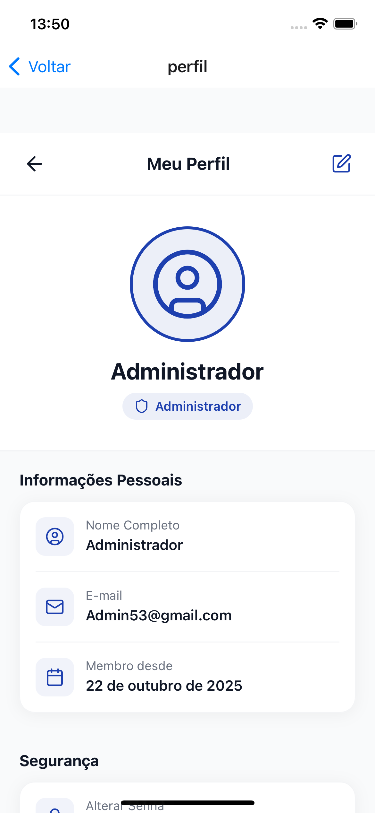
        <br />
        <strong>Perfil do Usuário</strong>
      </td>
    </tr>
  </table>
</div>

### 📅 Agenda e Compromissos

<div align="center">
  <table>
    <tr>
      <td align="center">
        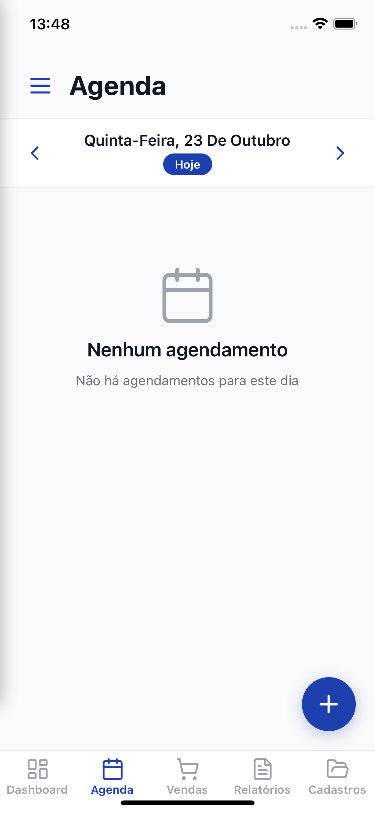
        <br />
        <strong>Agenda Diária</strong>
      </td>
      <td align="center">
        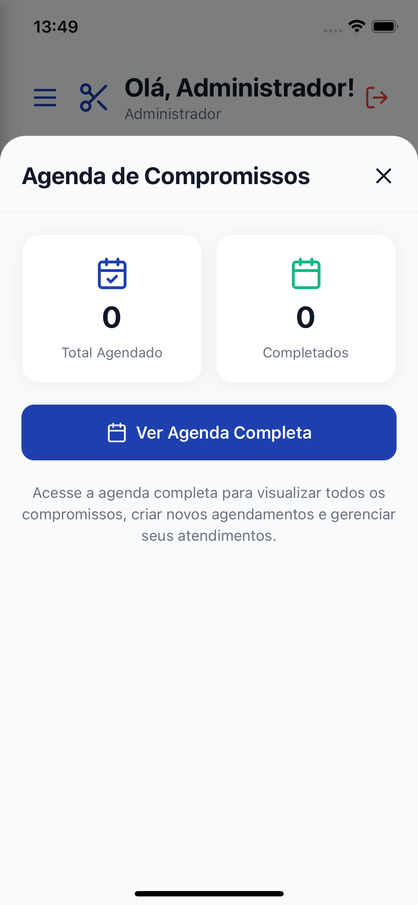
        <br />
        <strong>Lista de Compromissos</strong>
      </td>
      <td align="center">
        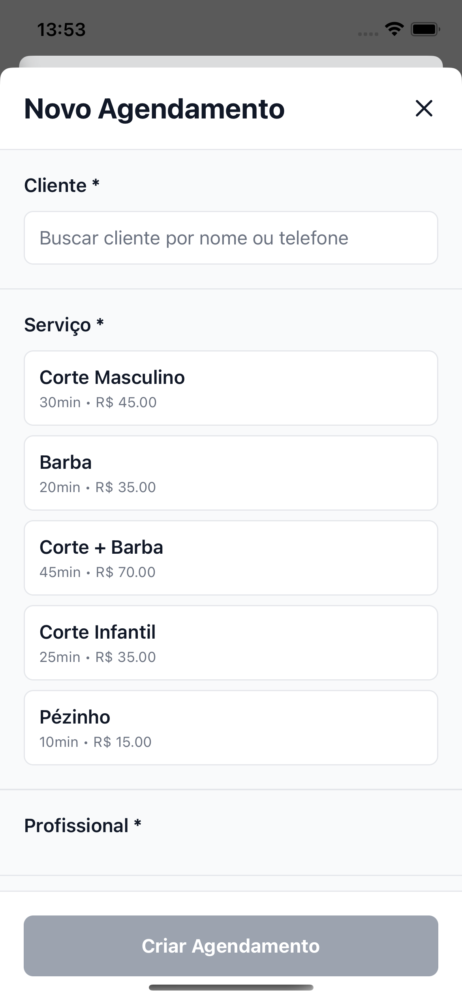
        <br />
        <strong>Novo Agendamento</strong>
      </td>
    </tr>
  </table>
</div>

### 💰 Vendas e Financeiro

<div align="center">
  <table>
    <tr>
      <td align="center">
        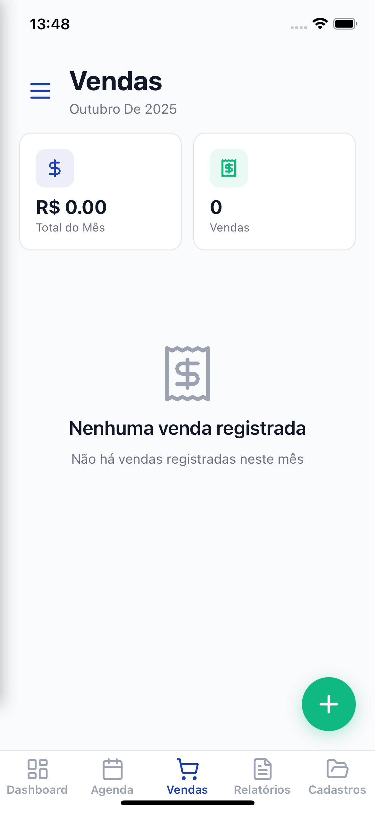
        <br />
        <strong>Histórico de Vendas</strong>
      </td>
      <td align="center">
        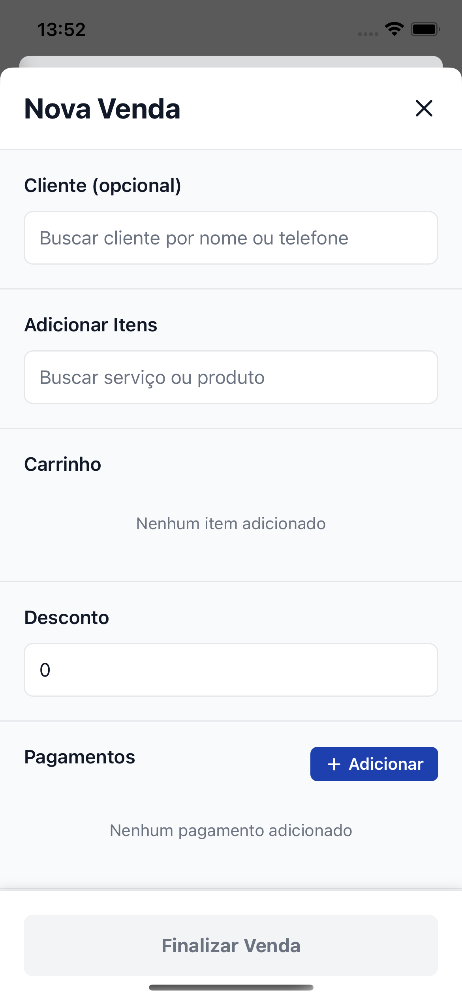
        <br />
        <strong>Nova Venda - PDV</strong>
      </td>
      <td align="center">
        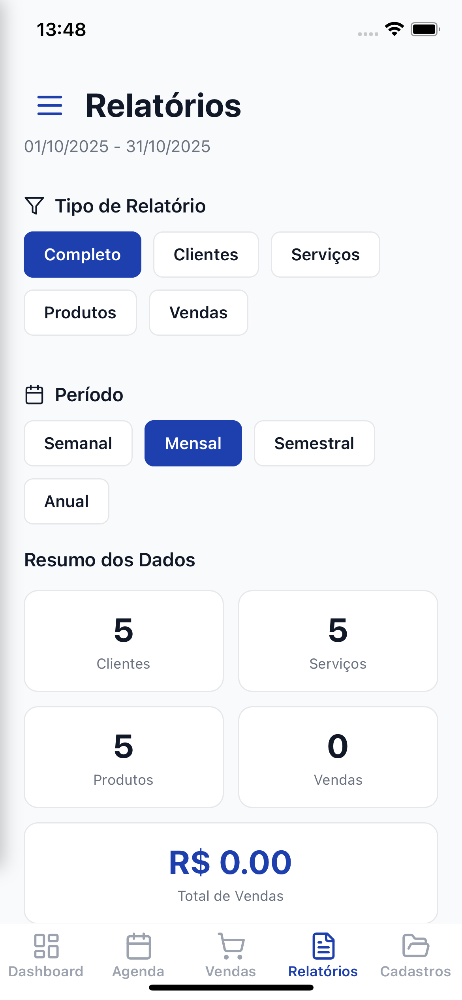
        <br />
        <strong>Relatórios</strong>
      </td>
    </tr>
  </table>
</div>

### 👥 Cadastros e Gestão

<div align="center">
  <table>
    <tr>
      <td align="center">
        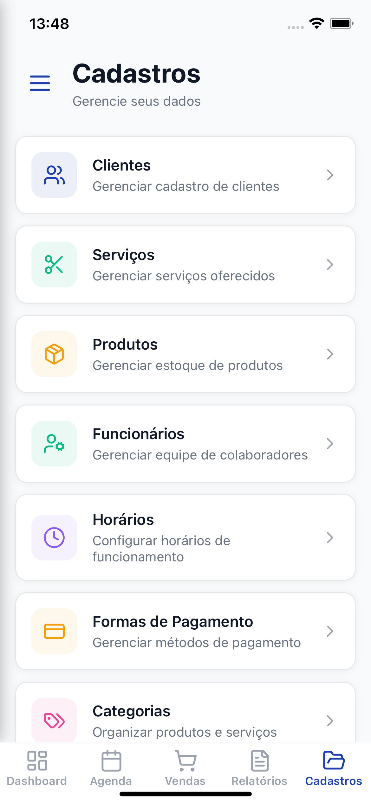
        <br />
        <strong>Menu de Cadastros</strong>
      </td>
      <td align="center">
        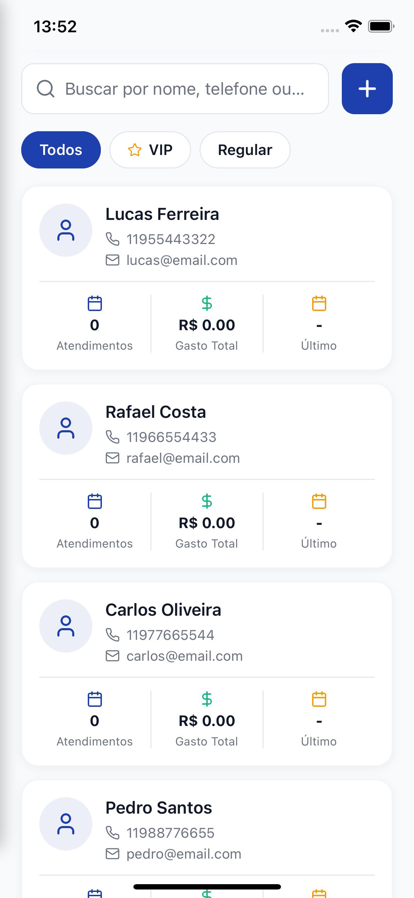
        <br />
        <strong>Gestão de Clientes</strong>
      </td>
      <td align="center">
        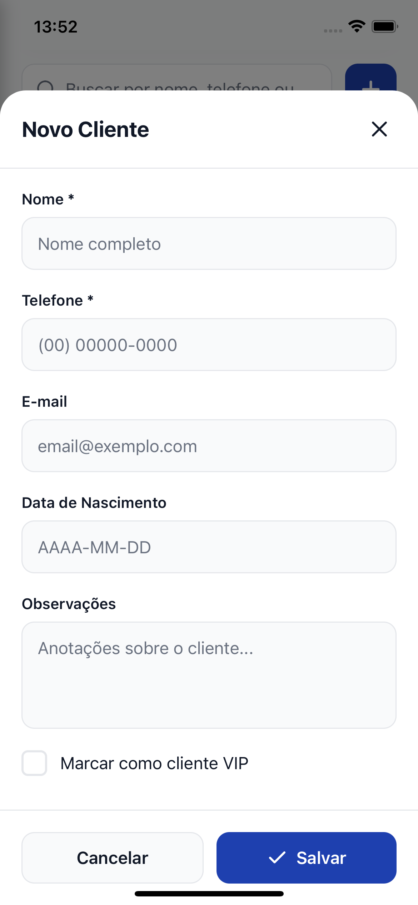
        <br />
        <strong>Cadastro de Cliente</strong>
      </td>
    </tr>
  </table>
</div>

### 💈 Serviços e Produtos

<div align="center">
  <table>
    <tr>
      <td align="center">
        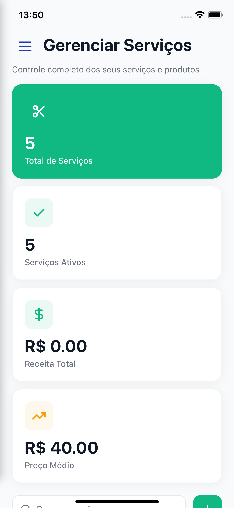
        <br />
        <strong>Gerenciar Serviços</strong>
      </td>
      <td align="center">
        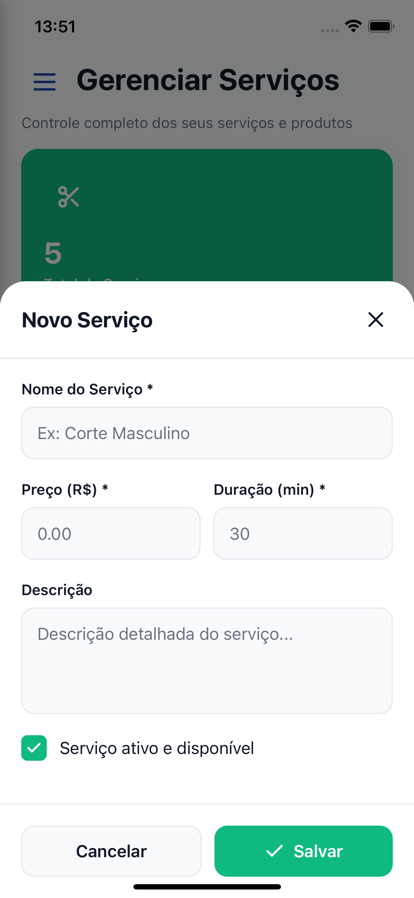
        <br />
        <strong>Cadastro de Serviço</strong>
      </td>
      <td align="center">
        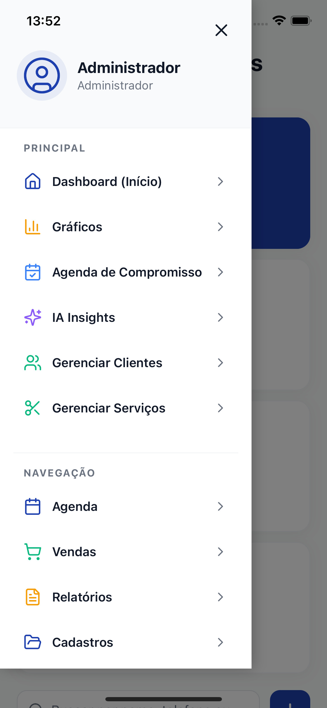
        <br />
        <strong>Menu de Navegação</strong>
      </td>
    </tr>
  </table>
</div>

### 📊 Resumo das Funcionalidades

| Categoria | Funcionalidades | Número de Telas |
|-----------|-----------------|-----------------|
| 🏠 **Dashboard** | Visão geral, Gráficos, IA | 3 |
| 🔐 **Autenticação** | Login, Recuperação, Perfil | 3 |
| 📅 **Agenda** | Visualização, Lista, Novo agendamento | 3 |
| 💰 **Vendas** | Histórico, PDV, Relatórios | 3 |
| 👥 **Clientes** | Menu, Gestão, Cadastro | 3 |
| 💈 **Serviços** | Gerenciamento, Cadastro, Menu | 3 |
| **Total** |  | **18 telas** |

---

## �🚀 Instalação

### 1. Clone e instale dependências
```bash
# As dependências já estão instaladas, mas se precisar:
bun install
```

### 2. Configure variáveis de ambiente

#### Supabase
O projeto já está configurado com as credenciais do Supabase em `lib/supabase.ts`:

```typescript
const supabaseUrl = 'https://icseawozzuwkkicsmqnf.supabase.co';
const supabaseAnonKey = 'eyJhbGciOiJIUzI1NiIsInR5cCI6IkpXVCJ9...';
```

#### Groq AI (Assistente Inteligente)
Para habilitar o assistente IA, você precisa configurar a chave da API Groq:

1. **Crie uma conta gratuita** em [console.groq.com](https://console.groq.com/)
2. **Gere uma API Key** no dashboard
3. **Crie um arquivo `.env`** na raiz do projeto:

```env
GROQ_API_KEY=sua_chave_aqui
```

4. **Para builds EAS**, configure a variável de ambiente:

```bash
eas secret:create --scope project --name GROQ_API_KEY --value sua_chave_aqui
```

> **Nota**: O arquivo `.env` está no `.gitignore` para proteger suas credenciais.

---

## 🗄️ Configuração do Supabase

### 1. Execute o Schema SQL
1. Acesse o [Supabase Dashboard](https://supabase.com/dashboard)
2. Navegue até: **SQL Editor**
3. Copie todo o conteúdo de `database/schema.sql`
4. Cole e execute

Isso criará:
- Todas as tabelas
- Índices otimizados
- Funções e triggers
- Políticas RLS
- Views para relatórios
- Dados de exemplo (tenant demo + serviços + produtos + clientes)

### 2. Crie os Storage Buckets
1. Vá em **Storage** > **Create bucket**
2. Crie os seguintes buckets:
   - `receipts` (recibos de venda)
   - `reports` (relatórios exportados)
   - `logos` (logos dos tenants)
   - `products` (fotos de produtos)

### 3. Configure Políticas de Storage
Para cada bucket, adicione políticas RLS:

```sql
-- Permitir leitura para usuários autenticados do mesmo tenant
CREATE POLICY "Allow authenticated users to read own tenant files"
ON storage.objects FOR SELECT
TO authenticated
USING (
  bucket_id = 'receipts' AND
  (storage.foldername(name))[1] = (SELECT tenant_id::text FROM users WHERE id = auth.uid())
);

-- Permitir upload para usuários autenticados
CREATE POLICY "Allow authenticated users to upload to own tenant folder"
ON storage.objects FOR INSERT
TO authenticated
WITH CHECK (
  bucket_id = 'receipts' AND
  (storage.foldername(name))[1] = (SELECT tenant_id::text FROM users WHERE id = auth.uid())
);
```

Repita para todos os buckets (`reports`, `logos`, `products`).

### 4. Crie o primeiro usuário Admin

#### Passo 1: Criar usuário no Supabase Auth
1. Acesse [Supabase Dashboard](https://supabase.com/dashboard)
2. Vá em **Authentication** > **Users** > **Add user**
3. **Método**: Email
4. Preencha:
   - **Email**: `Admin53@gmail.com`
   - **Password**: `EpKrRd020413`
   - ✅ Marque **Auto Confirm User** (importante!)
5. Clique em **Create user**
6. **IMPORTANTE**: Copie o **UUID** do usuário criado (aparece na lista de usuários)

#### Passo 2: Vincular ao tenant
1. Vá em **SQL Editor**
2. Cole o comando abaixo, **substituindo** `<UUID_DO_USER>` pelo UUID copiado:

```sql
-- Vincule o usuário ao tenant demo como Admin
INSERT INTO users (id, tenant_id, email, full_name, role)
VALUES (
  '<UUID_DO_USER>',  -- ⚠️ SUBSTITUA pelo UUID copiado do Authentication
  '00000000-0000-0000-0000-000000000001',  -- tenant demo
  'admin@demo.com',
  'Administrador',
  'admin'
);
```

3. Execute o comando
4. Se tudo der certo, você verá: "Success. No rows returned"

#### Credenciais para login no app:
```
Email: admin@demo.com
Senha: Admin123!
```

---

## 📱 Executar o App

```bash
# Inicie o servidor de desenvolvimento
bun start

# Ou para web
bun start-web
```

Escaneie o QR code com:
- **iOS**: Câmera nativa ou Expo Go
- **Android**: Expo Go app

---

## 📂 Estrutura do Projeto

```
barbearia-pro/
├── app/                    # Rotas Expo Router
│   ├── (tabs)/            # Navegação por tabs
│   │   ├── index.tsx      # Dashboard
│   │   ├── agenda.tsx     # Agenda
│   │   ├── vendas.tsx     # Vendas
│   │   └── cadastros.tsx  # Cadastros
│   ├── login.tsx          # Login
│   ├── _layout.tsx        # Root layout
│   └── +not-found.tsx     # 404
├── contexts/              # React contexts
│   └── AuthContext.tsx    # Auth state global
├── lib/                   # Bibliotecas e configs
│   └── supabase.ts        # Cliente Supabase
├── types/                 # TypeScript types
│   └── database.ts        # Types do banco
├── constants/             # Constantes
│   └── colors.ts          # Paleta de cores
├── database/              # SQL schemas
│   └── schema.sql         # Schema completo
├── SETUP.md               # Este arquivo
└── package.json
```

---

## 👥 Papéis e Permissões

### Admin
- Acesso total ao sistema
- Gerenciar usuários, configurações
- Ver todos os relatórios
- Acesso a todas as funcionalidades

### Barbeiro
- Consultar agenda própria
- Registrar atendimentos e vendas associadas
- Ver clientes
- **Não pode** alterar configurações ou ver dados de outros barbeiros

### Atendente
- Gerenciar agenda de todos os barbeiros
- Registrar vendas
- Ver e cadastrar clientes
- **Não pode** acessar relatórios financeiros completos

**Implementação:**
- RLS garante que cada usuário só vê dados do seu tenant
- Verificações adicionais por papel podem ser feitas no frontend
- Funções do Supabase: `get_user_role()`, `get_user_tenant_id()`

---

## 🔄 Fluxos Principais

### Fluxo de Login
1. Usuário insere email/senha
2. `signIn()` chama `supabase.auth.signInWithPassword()`
3. Supabase retorna JWT
4. `AuthContext` busca perfil do usuário na tabela `users`
5. Se autenticado, redireciona para `/(tabs)`
6. Se não autenticado, redireciona para `/login`

### Fluxo de Agendamento
1. Usuário clica no FAB da Agenda
2. Formulário de novo agendamento
3. Seleção de cliente, serviço, barbeiro, data/hora
4. Validação de conflitos via função `check_appointment_conflict()`
5. Inserção na tabela `appointments`
6. RLS garante que `tenant_id` está correto
7. Lista de agendamentos atualiza automaticamente (React Query)

### Fluxo de Venda
1. Atendente/Admin clica no FAB de Vendas
2. PDV: adiciona serviços/produtos ao carrinho
3. Seleciona cliente (opcional)
4. Aplica desconto (opcional)
5. Registra pagamentos (pode ser múltiplos)
6. Ao salvar:
   - Cria registro em `sales`
   - Cria registros em `sale_items`
   - Cria registros em `payments`
   - **Trigger automático** diminui estoque de produtos
   - **Trigger automático** recalcula totais da venda
7. Geração de recibo (futuro: PDF no Storage)

### Fluxo de Estoque
- **Entrada de produto**: Admin registra compra → trigger cria `stock_movement` tipo `purchase`
- **Venda de produto**: Trigger automático cria `stock_movement` tipo `sale` e diminui `stock_quantity`
- **Ajuste manual**: Admin pode ajustar estoque → cria movimento tipo `adjustment`
- **Alertas**: View `inventory_status` mostra produtos com estoque baixo

---

## 📊 Relatórios e Views

O banco possui views otimizadas para relatórios:

### daily_revenue
```sql
SELECT * FROM daily_revenue
WHERE tenant_id = '<tenant_id>'
  AND sale_date >= '2024-01-01';
```
Retorna: total_sales, total_revenue, avg_ticket, total_discounts por dia

### service_performance
```sql
SELECT * FROM service_performance
WHERE tenant_id = '<tenant_id>'
ORDER BY total_revenue DESC
LIMIT 10;
```
Retorna: serviços mais vendidos, receita por serviço

### barber_performance
```sql
SELECT * FROM barber_performance
WHERE tenant_id = '<tenant_id>'
ORDER BY total_revenue DESC;
```
Retorna: performance por barbeiro (vendas, itens, receita)

### inventory_status
```sql
SELECT * FROM inventory_status
WHERE tenant_id = '<tenant_id>' AND status = 'low_stock';
```
Retorna: produtos com estoque baixo ou zerado

---

## 🚢 Deploy

### Mobile (Expo)
```bash
# Build APK (Android)
eas build --platform android --profile production

# Build IPA (iOS)
eas build --platform ios --profile production
```

### Web (se aplicável)
```bash
bun expo export:web
```

---

## 🔐 Segurança

1. **Row Level Security (RLS)**: Todas as tabelas têm políticas que verificam `tenant_id`
2. **Auth Context**: Verifica autenticação antes de renderizar rotas protegidas
3. **Anon Key**: Só a chave anônima é exposta no cliente
4. **Senhas**: Hash com bcrypt no Supabase Auth
5. **Audit Logs**: Tabela `audit_logs` registra ações importantes

---

## 🧪 Dados de Teste

O schema inclui dados de exemplo:
- **Tenant**: Barbearia Demo (slug: `demo`)
- **Serviços**: Corte Masculino, Barba, Corte + Barba, Corte Infantil, Pézinho
- **Produtos**: Pomada, Shampoo, Óleo para Barba, Cera, Balm
- **Clientes**: João Silva, Pedro Santos, Carlos Oliveira, Rafael Costa, Lucas Ferreira

**Credenciais de acesso**:
```
Email: admin@demo.com
Senha: Admin123!
```

⚠️ **Importante**: Você precisa criar o usuário manualmente no Supabase seguindo as instruções na seção [Configuração do Supabase](#configuração-do-supabase).

---

## 📝 Próximos Passos e Roadmap

### 🚀 Em Desenvolvimento
- [ ] **CRUD Completo** de Clientes, Serviços e Produtos
- [ ] **PDV Completo** com carrinho de compras interativo
- [ ] **Notificações Push** para lembretes de agendamento
- [ ] **Calendário Semanal** na Agenda com visualização ampliada
- [ ] **Modo Escuro** (Dark Mode)

### 🎯 Planejado para Próximas Versões
- [ ] **Relatórios Exportáveis** (CSV, PDF, Excel)
- [ ] **Gráficos Avançados** (Linhas, Barras, Pizza, Funil)
- [ ] **Envio de Lembretes** por email/SMS/WhatsApp
- [ ] **Busca e Filtros Avançados** em todas as telas
- [ ] **Perfil de Cliente** com histórico completo de atendimentos
- [ ] **Sistema de Comissões** para barbeiros
- [ ] **Programa de Fidelidade** para clientes
- [ ] **Agendamento Online** - App para clientes finais
- [ ] **Integração com Pagamento** (PIX, Cartão)
- [ ] **Multi-idioma** (PT, EN, ES)
- [ ] **Backup Automático** de dados
- [ ] **Modo Offline** com sincronização

### 💡 Ideias Futuras
- [ ] **Reconhecimento Facial** para check-in
- [ ] **Análise Preditiva** de horários de pico com IA
- [ ] **Sugestões Personalizadas** de serviços baseadas em IA
- [ ] **Integração com Redes Sociais** para marketing
- [ ] **Gamificação** para engajamento de clientes

---

## 🐛 Troubleshooting

### ❌ Erro: "Row Level Security policy violation"
**Causa**: O usuário não está vinculado corretamente ao tenant.

**Solução**:
1. Verifique se o usuário existe na tabela `users`:
```sql
SELECT * FROM users WHERE email = 'seu@email.com';
```
2. Verifique se o `tenant_id` está correto
3. Confirme que as políticas RLS foram criadas corretamente executando todo o `schema.sql`

---

### ❌ Erro: "Invalid JWT" ou "Session expired"
**Causa**: Token de autenticação expirado ou inválido.

**Solução**:
1. Faça logout e login novamente no app
2. Verifique se as credenciais do Supabase em `lib/supabase.ts` estão corretas
3. Limpe o cache do app e reinstale

---

### ❌ Dados não aparecem no Dashboard
**Causa**: Sem dados no banco ou problema de sincronização.

**Solução**:
1. Verifique se o `tenant_id` do usuário está correto:
```sql
SELECT tenant_id FROM users WHERE id = auth.uid();
```
2. Execute queries diretamente no SQL Editor do Supabase para verificar dados
3. Confira o console do navegador/app para erros JavaScript
4. Use `Pull-to-Refresh` nas telas para forçar atualização

---

### ❌ Erro ao fazer build EAS: "Secret scanning detected"
**Causa**: API keys expostas no código.

**Solução**:
1. Mova todas as chaves para variáveis de ambiente (`.env`)
2. Configure secrets no EAS:
```bash
eas secret:create --scope project --name GROQ_API_KEY --value sua_chave
```
3. Reescreva o histórico do Git se necessário (veja seção anterior)

---

### ❌ App não conecta ao Supabase
**Causa**: Credenciais incorretas ou problemas de rede.

**Solução**:
1. Verifique a URL e Anon Key em `lib/supabase.ts`
2. Teste a conexão no SQL Editor do Supabase
3. Verifique se o projeto Supabase está ativo
4. Confirme que não há firewall bloqueando a conexão

---

### ❌ Assistente IA não responde
**Causa**: Chave da API Groq não configurada ou inválida.

**Solução**:
1. Verifique se `GROQ_API_KEY` está no `.env`
2. Confirme que a chave é válida em [console.groq.com](https://console.groq.com/)
3. Verifique se há créditos disponíveis na conta Groq
4. Confira o console para erros de API

---

## ❓ FAQ (Perguntas Frequentes)

### **P: O SmartAgenda é gratuito?**
**R**: Sim, o código-fonte é open-source sob licença MIT. Porém, você precisará de uma conta Supabase (gratuita até certo limite) e Groq (também gratuita) para rodar.

### **P: Posso usar para múltiplas barbearias?**
**R**: Sim! O sistema é multi-tenant. Cada barbearia é um tenant separado com isolamento total de dados.

### **P: Funciona offline?**
**R**: Atualmente não, mas está no roadmap. O app requer conexão com internet para sincronizar com o Supabase.

### **P: Posso personalizar o design?**
**R**: Sim! O código é totalmente aberto. Você pode modificar cores em `constants/colors.ts` e componentes conforme necessário.

### **P: Como faço backup dos dados?**
**R**: Os dados estão no Supabase. Você pode exportar via SQL Editor ou usar a API do Supabase para backups automáticos.

### **P: Suporta quais formas de pagamento?**
**R**: Atualmente registra vendas com múltiplos métodos (Dinheiro, Cartão, PIX, etc.). Integração com gateways de pagamento está planejada.

### **P: Posso contribuir com o projeto?**
**R**: Absolutamente! Pull requests são bem-vindos. Veja a seção [Contribuindo](#-contribuindo) abaixo.

---

## 🤝 Contribuindo

Contribuições são muito bem-vindas! Para contribuir:

1. **Fork** o repositório
2. Crie uma **branch** para sua feature (`git checkout -b feature/MinhaFeature`)
3. **Commit** suas mudanças (`git commit -m 'Adiciona nova feature'`)
4. **Push** para a branch (`git push origin feature/MinhaFeature`)
5. Abra um **Pull Request**

### Diretrizes
- Siga o estilo de código existente (TypeScript + ESLint)
- Adicione testes quando aplicável
- Documente novas funcionalidades
- Mantenha commits atômicos e descritivos

---

## 📄 Licença

Este projeto está sob a licença **MIT**. Veja o arquivo [LICENSE](LICENSE) para mais detalhes.

---

## 📞 Suporte

Precisa de ajuda? Aqui estão alguns recursos:

- 📖 **Documentação**: Leia este README e os comentários no código
- 🗄️ **Schema SQL**: Consulte `database/schema.sql` para entender o modelo de dados
- 📚 **Documentação Supabase**: [supabase.com/docs](https://supabase.com/docs)
- 📱 **Documentação Expo**: [docs.expo.dev](https://docs.expo.dev/)
- 💬 **Issues**: Abra uma [issue no GitHub](../../issues) para reportar bugs ou sugerir features

---

## 🙏 Agradecimentos

Este projeto foi construído com tecnologias incríveis:

- [React Native](https://reactnative.dev/) - Framework mobile
- [Expo](https://expo.dev/) - Plataforma de desenvolvimento
- [Supabase](https://supabase.com/) - Backend as a Service
- [TypeScript](https://www.typescriptlang.org/) - Tipagem estática
- [TanStack Query](https://tanstack.com/query) - Gerenciamento de estado
- [Lucide Icons](https://lucide.dev/) - Ícones modernos
- [Groq](https://groq.com/) - API de IA ultrarrápida

---

<div align="center">

**Desenvolvido com ❤️ para a comunidade de barbeiros**

⭐ **Se este projeto foi útil, considere dar uma estrela!** ⭐

[](https://github.com/Smart-Agenda-Pro/SmartAgenda/stargazers)
[](https://github.com/Smart-Agenda-Pro/SmartAgenda/network/members)

---

**© 2025 SmartAgenda | Transformando a gestão de barbearias** 💈

</div>
